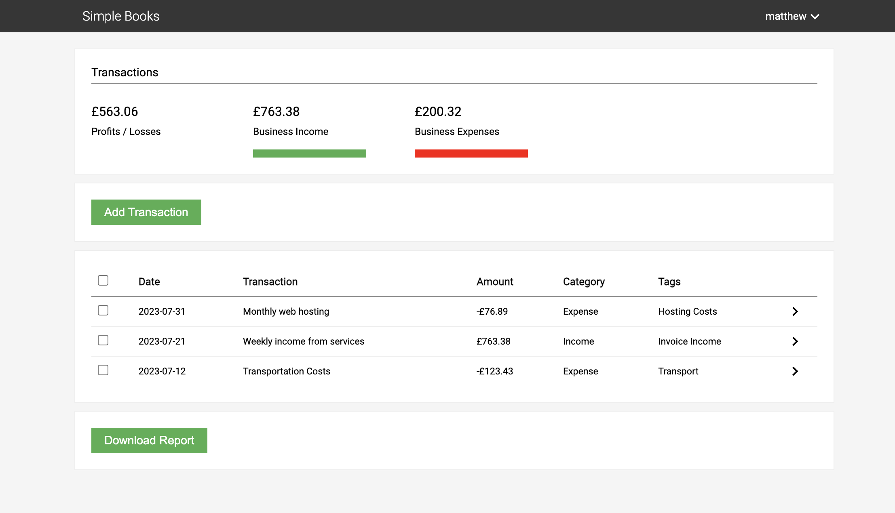
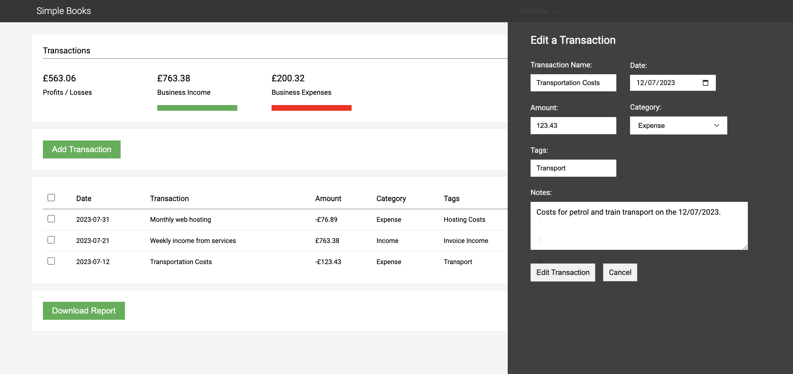
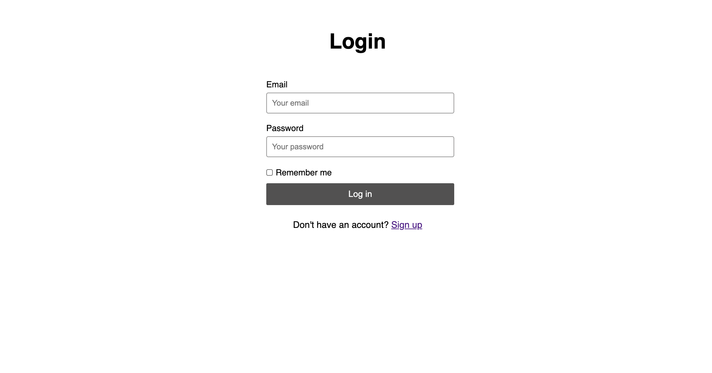
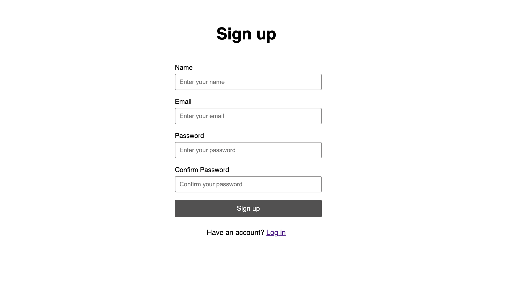

#  Simple Books

Simple Books is a free tool designed for freelancers, sole traders, and small businesses to help make bookkeeping more efficent.

<a href="">Live Demo</a>

## Key features

-   Self-hosted solution to managing your finance
-   Secure multi account access
-   Organise transactions by category and tags
-   Add attachments to each transaction
-   Export your transactions records to csv

## Installation

Simple Books is a PHP application built on Laravel that can be self-hosted.

To install on a local machine, first set up the correct MYSQL database config inside .env file. Upon installation the database tables will be automatically created.

```
DB_CONNECTION=mysql
DB_HOST=127.0.0.1
DB_PORT=3306
DB_DATABASE="simple_books"
DB_USERNAME=root
DB_PASSWORD=""
```

Then run the following commands from terminal inside the Simple-Books directory:

Resolves and installs the required dependencies.

```
composer install
```

Generates APP_KEY value.

```
php artisan key:generate
```

Migrate the database.

```
php artisan migrate
```

Runs the project.

```
php artisan serve
```

## Screenshots






## License

Simple Books is released under the GNU General Public License v3 for open-source personal projects.

This means you are free to modify and distribute under the GPL license if the copyright and credits notices remain untouched.

View this [resource](https://choosealicense.com/licenses/gpl-3.0/) for more information on the GPL License.
